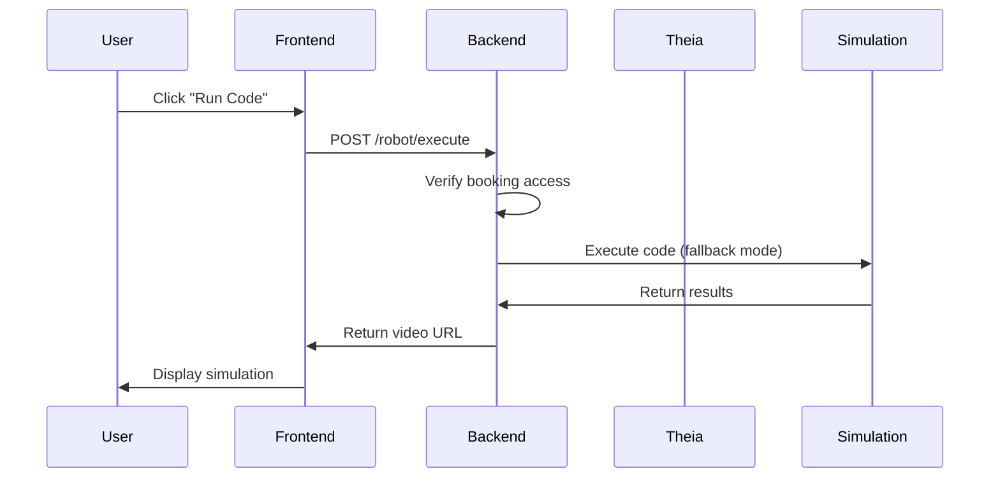

# 🚀 Eclipse Theia Integration Usage Guide

## Overview

This guide explains how to use the Eclipse Theia IDE integration with the Robot Live Console platform after the recent fixes and improvements.

## 🔧 Fixed Issues

### ✅ Robot Code Execution
- **Fixed**: Missing `executeRobotCode` function in frontend API
- **Added**: `POST /robot/execute` endpoint in backend
- **Result**: "Run Code" button now works properly

### ✅ Admin Container Management
- **Added**: Additional admin endpoints for container management
- **New endpoints**:
  - `POST /theia/admin/stop/{user_id}` - Stop any user's container
  - `POST /theia/admin/restart/{user_id}` - Restart any user's container  
  - `GET /theia/admin/status/{user_id}` - Get any user's container status

## 📋 User Workflow

### 1. Access Requirements
- Complete at least one booking for the robot type you want to program
- Login to the platform with your credentials

### 2. Start Theia IDE
1. Navigate to the IDE section
2. Click "Start IDE" button
3. Wait for container to initialize (~10-30 seconds)
4. Access your personalized development environment

### 3. Code Development
- Write Python or C++ code in the Theia IDE
- Your files are automatically saved in `/projects/<your_user_id>/`
- Files persist between sessions

### 4. Code Execution (NEW)
1. Write your robot control code
2. Click "Run Code" button in the video player section
3. Select your robot type (turtlebot, arm, hand)
4. View simulation results (currently shows reference videos)

## 🛠️ Admin Features

### Container Management
Admins can now:
- View all active Theia containers
- Stop/restart any user's container
- Monitor container status
- Access via admin dashboard

### User Support
- Help users with stuck containers
- Force restart problematic sessions
- Monitor resource usage

## 🔗 API Endpoints

### User Endpoints
```
GET  /theia/status          - Get your container status
POST /theia/start           - Start your container
POST /theia/stop            - Stop your container
POST /theia/restart         - Restart your container
POST /robot/execute         - Execute robot code (NEW)
```

### Admin Endpoints
```
GET  /theia/containers           - List all containers
POST /theia/admin/stop/{user_id} - Stop user's container
POST /theia/admin/restart/{user_id} - Restart user's container
GET  /theia/admin/status/{user_id} - Get user's container status
```

## 🧪 Testing

### Manual Testing Steps
1. Login with demo account
2. Start Theia container
3. Write simple robot code
4. Execute code via "Run Code" button
5. Verify video/result display

### Admin Testing
1. Login as admin
2. View container list in admin dashboard
3. Test container management controls
4. Verify user isolation

## 🔄 Code Execution Flow



## 🎯 Current Limitations

### Simulation Service
- Currently uses "fallback mode" with reference videos
- Full robot simulation integration pending
- Gazebo/ROS integration to be implemented

### Resource Management
- No container resource limits yet
- Manual cleanup required for long-running containers
- Memory/CPU monitoring not implemented

## 🔮 Future Enhancements

### Real-time Features
- WebSocket support for live execution status
- Real-time collaboration in Theia
- Live robot sensor data streaming

### Simulation Improvements
- Full Gazebo integration
- Custom simulation environments
- Real robot control (when available)

### IDE Features
- Extension marketplace integration
- Git-based version history
- Advanced debugging tools

## 🐛 Troubleshooting

### Container Won't Start
1. Check if Docker is running
2. Verify user has completed booking
3. Try restarting the container
4. Contact admin if issues persist

### Code Execution Fails
1. Verify robot type matches your booking
2. Check code syntax
3. Ensure you have booking access
4. Try with simpler code first

### Connection Issues
1. Refresh the page
2. Clear browser cache
3. Check network connectivity
4. Verify authentication token

## 📞 Support

For technical issues:
1. Check the admin dashboard for system status
2. Contact platform administrators
3. Review application logs
4. Submit bug reports via the platform

---

*Last updated: September 16, 2024*