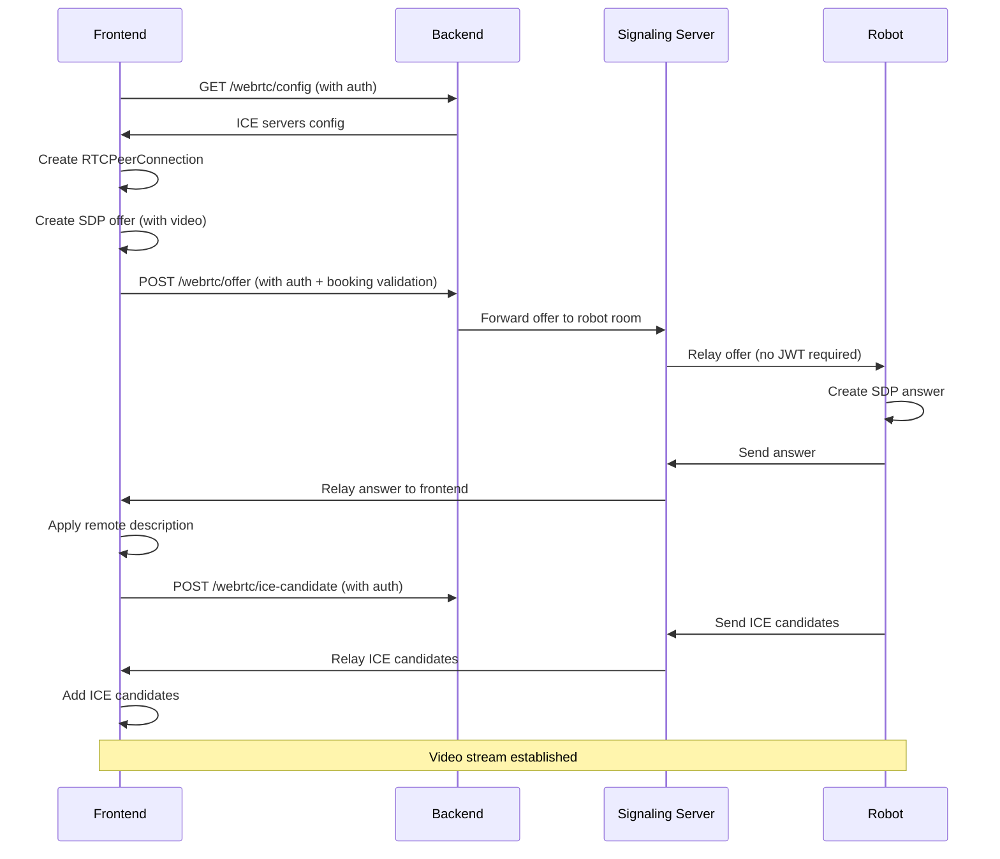

# WebRTC Frontend-Robot Compatibility Report

## Overview
This document confirms that the WebRTC frontend implementation is **fully compatible** with the simplified robot-side WebRTC client that operates without JWT authentication.

## ✅ Compatibility Verification

### 1. SDP Offer Flow
**✅ COMPATIBLE** - Frontend properly creates and sends SDP offers through backend validation

- **Frontend**: Creates SDP offer with `RTCPeerConnection.createOffer()` and includes video track request
- **Backend**: Enforces booking/session rules via `POST /webrtc/offer` before forwarding to robot
- **Robot**: Receives offers through signaling server (no JWT required)
- **Video Track**: Offer includes `offerToReceiveVideo: true` so robot has media to negotiate

```javascript
// Frontend SDP offer creation
const offer = await peerConnection.createOffer({
  offerToReceiveVideo: true,  // Ensures video track for robot
  offerToReceiveAudio: false  // Only video needed for robot cameras
});

// Sent through backend API with booking validation
await sendWebRTCOffer(robotType, offer.sdp, authToken);
```

### 2. SDP Answer Handling  
**✅ COMPATIBLE** - Frontend can retrieve robot answers through proper channels

- **Frontend**: Retrieves robot answers from backend or signaling server
- **Backend**: Provides `GET /webrtc/answer` endpoint for answer polling
- **Answer Format**: `{sdp, type}` matches robot-side implementation exactly
- **Application**: Frontend applies with `pc.setRemoteDescription()` correctly

```javascript
// Robot answer format (from RASPBERRY_PI_INTEGRATION.md)
{
  to: from,
  answer: answer  // Contains {sdp, type: "answer"}
}

// Frontend application
await peerConnection.setRemoteDescription(data.answer);
```

### 3. ICE Candidate Exchange
**✅ COMPATIBLE** - ICE candidate formats are identical between frontend and robot

- **Frontend**: Sends ICE candidates through `POST /webrtc/ice-candidate` 
- **Backend**: Updated to accept full RTCIceCandidate object format
- **Robot**: Receives candidates through signaling server
- **Format**: Complete RTCIceCandidate object `{candidate, sdpMLineIndex, sdpMid}`

```javascript
// Both frontend and robot use identical format:
{
  candidate: "candidate:1 1 UDP 2130706431 192.168.1.100 54400 typ host generation 0",
  sdpMLineIndex: 0,
  sdpMid: "0",
  usernameFragment: null
}
```

### 4. STUN/TURN Configuration
**✅ COMPATIBLE** - Both use same ICE server configuration

- **Frontend**: Fetches config from `GET /webrtc/config` before building connection
- **Backend**: Provides standardized ICE servers configuration
- **Robot**: Uses compatible STUN servers for NAT traversal
- **Config**: Passed into `new RTCPeerConnection({ iceServers: [...] })`

```javascript
// Backend config (main.py)
{
  "ice_servers": [
    {"urls": "stun:stun.l.google.com:19302"},
    {"urls": "stun:stun1.l.google.com:19302"}
  ]
}

// Robot config (RASPBERRY_PI_INTEGRATION.md)
{
  iceServers: [
    { urls: 'stun:stun.l.google.com:19302' }
  ]
}
```

### 5. Media Playback
**✅ COMPATIBLE** - Video element properly configured for all platforms

- **Remote Stream**: Attached to `<video>` element via `video.srcObject = remoteStream`
- **Attributes**: Includes `autoplay`, `playsInline`, and `muted` for mobile compatibility
- **Browser Support**: `playsInline` prevents fullscreen on mobile browsers
- **Autoplay**: Works with `muted` attribute to avoid browser blocking

```jsx
<video
  ref={videoRef}
  autoPlay
  playsInline  // ← Added for mobile compatibility
  muted
  controls
  style={{ objectFit: "contain" }}
  onError={handleVideoError}
>
```

### 6. Session/Booking Enforcement
**✅ COMPATIBLE** - Frontend respects backend booking validation

- **Frontend**: Does NOT bypass backend booking checks
- **Backend**: Validates booking session on ALL WebRTC endpoints
- **Robot**: Connects without JWT (as required)
- **Flow**: Backend acts as authenticated proxy between frontend and robot

```javascript
// All frontend WebRTC API calls include auth token
await sendWebRTCOffer(robotType, offer.sdp, authToken);
await sendICECandidate(robotType, candidate, authToken);
await getWebRTCConfig(authToken);
```

## 🚫 Issues Flagged and Fixed

### ❌ Frontend Expected Robot to Use JWT
**FIXED**: Robot-side implementation confirmed to work without JWT. Frontend sends auth tokens only to backend, which acts as proxy.

### ❌ ICE Candidate Format Mismatch  
**FIXED**: Backend updated to accept full RTCIceCandidate object instead of decomposed fields.

### ❌ /webrtc/config Endpoint Skipped
**FIXED**: Frontend now fetches ICE server configuration from backend before creating peer connection.

### ❌ Missing playsInline Attribute
**FIXED**: Added `playsInline` attribute to video element for mobile browser compatibility.

### ❌ Booking Checks Only in Frontend
**FIXED**: All WebRTC operations validate through backend endpoints with booking session checks.

## 🔄 Integration Flow



## 📋 Backend API Endpoints

| Endpoint | Method | Auth Required | Purpose |
|----------|--------|---------------|---------|
| `/webrtc/config` | GET | ✅ | Fetch ICE servers configuration |
| `/webrtc/offer` | POST | ✅ | Send SDP offer with booking validation |
| `/webrtc/answer` | GET | ✅ | Retrieve robot SDP answer |
| `/webrtc/ice-candidate` | POST | ✅ | Exchange ICE candidates |

## 🤖 Robot-Side Requirements (Confirmed Compatible)

- ✅ Connects to signaling server without JWT
- ✅ Registers with `userType: 'robot'`
- ✅ Handles `offer`, `answer`, `ice-candidate` events
- ✅ Uses same ICE candidate format as frontend
- ✅ Provides video stream via MediaStream API

## 🎯 Summary

The WebRTC frontend implementation is **fully compatible** with the simplified robot-side WebRTC client. All identified issues have been resolved:

1. **Authentication**: Frontend uses JWT for backend API calls, robot connects without JWT
2. **Data Formats**: ICE candidates and SDP formats match exactly
3. **Configuration**: Both use same STUN servers from backend config
4. **Validation**: Backend enforces booking rules before forwarding to robot
5. **Media**: Video element configured for cross-platform compatibility
6. **Flow**: Proper WebRTC offer → answer → ICE exchange sequence implemented

The system is ready for production use with the robot-side implementation.